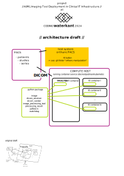

# (i²)² Framework

The (i²)² Framework is a collection of tools for deploying AI-based image processing tools in a healthcare environment.
The framework is designed to be modular and flexible, allowing for easy integration with existing systems.
It communicates with PACS systems via standard DICOM protocols and provides tools to convert between common file
formats (DICOM Images, DICOM-Seg, nifti, numpy, SimpleITK).
We were able to get it running in connection with the Orthanc PACS system including the OHIF Image viewer, but without
using any system-specific interfaces, only standard DICOM communication protocols.
Thus, with minimal effort it should be possible to connect it to other PACS systems as well.

## Typical workflow

1. (one-time setup) The python dicom server is configured as a DICOM node in the PACS system.
2. The user pushes a button in the PACS system to send the images to the image processing tool.
3. The python framework receives the images and hands them over to the image processing tool including common data
   processing utilities.
4. The image processing tool processes the images and returns the results in DICOM format (again, utilities for
   converting nifti to dicom are included).
5. The python framework sends the results back to the PACS system.
6. The user can view the results in the PACS system.

## Software architecture draft

## How to connect an image processing tool to a PACS

(Instructions unfinished, use at own risk)

1. Clone this repository
2. Create a subclass of ImageProcessingResult or pick an existing one for storing the results (For example
   SegmentationResult)
3. Create a subclass of ImageProcessingTool that implements the (AI-based or other) image processing and outputs the
   ImageProcessingResult from step 2. You may want to have a look at the methods in the ImageProcessingTool, Image, and
   ProcessingResult classes to see if something already fits your needs (e.g. conversion between data formats).
4. (optional?) Put everything in a docker container
5. Create a subclass of SenderConfiguration to specify where the results should be sent to (port, ip and AET-name of the
   PACS system)
6. Start dicom_receiver.py to be able to receive images (you may want to adjust the port and AET-name in there as well)
7. Edit watchdog.py to use your ImageProcessingTool and SenderConfiguration from steps 3 and 5
8. Start watchdog.py that will watch for newly received images, process them and send them back to the PACS system